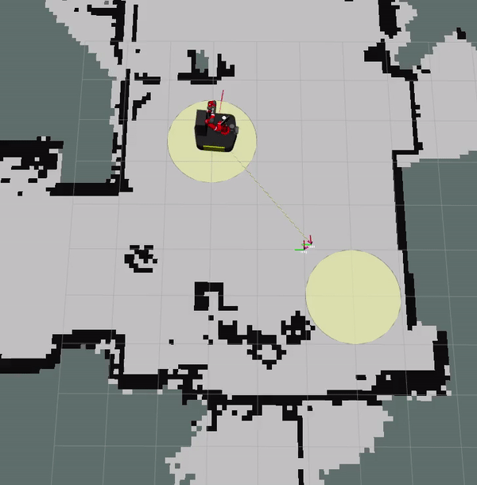
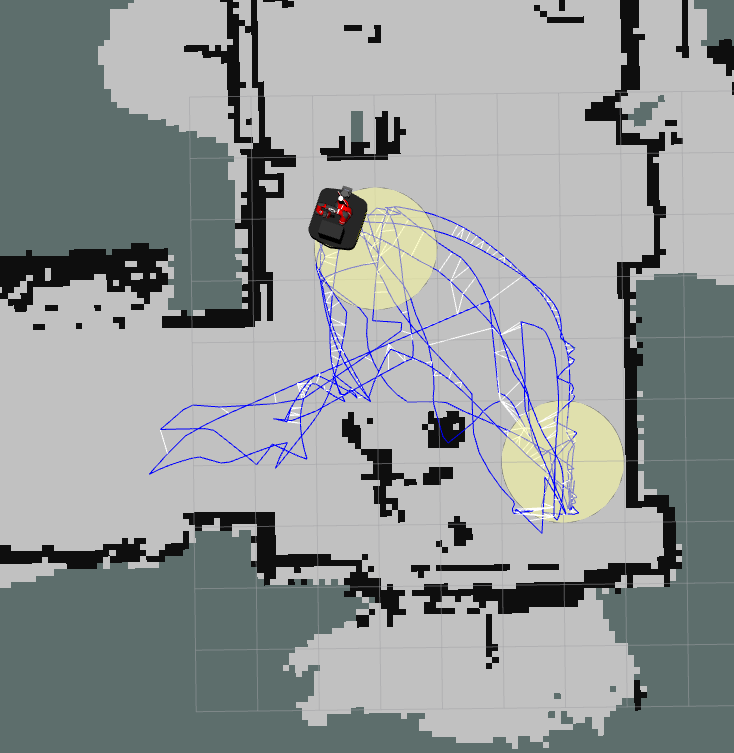
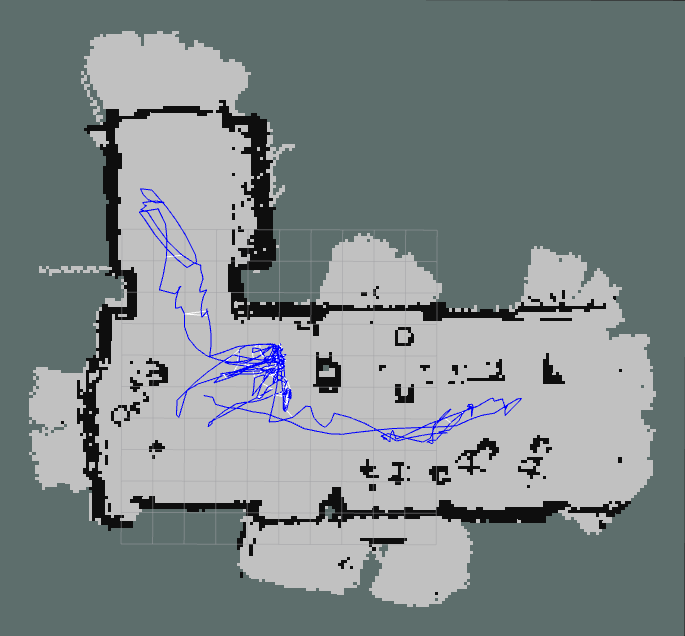
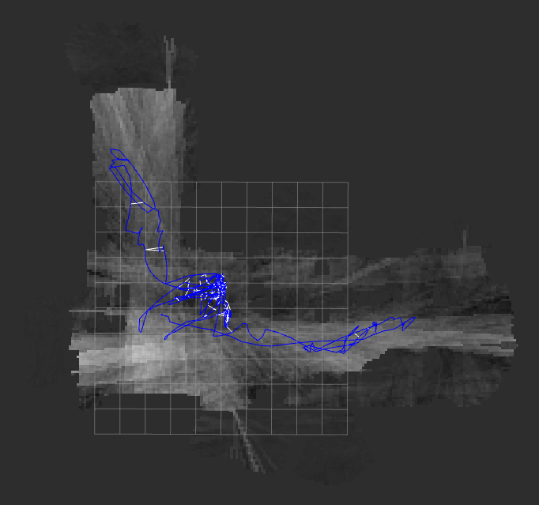

# Ergodic Exploration

[](https://github.com/bostoncleek/ergodic_exploration/releases)
[](https://github.com/bostoncleek/ergodic_exploration/graphs/commit-activity)
[](https://github.com/bostoncleek/ergodic_exploration/pulls)
[](https://github.com/bostoncleek)

<!-- []() -->

<p align="center">
  
</p>

# Motivation
Currently there are no exploration packages for ROS Noetic. The ROS packages that currently exist perform only frontier exploration. The goal of this project is to provide a robot agnostic information theoretic exploration strategy for known and unknown environments.

This package requires a user specified target distribution representing the expected
information gain. The target distribution is represented as a Gaussian or multiple Gaussians.

As an alternative, mutual information can be used as the target distribution. Checkout the `feature/sportdeath_mi` branch. That branch is experimental because the mutual information implementation has not been verified yet.

This package was developed at [Northwestern University](https://robotics.northwestern.edu/) during the Master of Science in Robotics program.

# Table of Contents
- [Motivation](#Motivation) </br>
- [Exploration](#Exploration) </br>
  - [Ergodic Control](#Ergodic-Control) </br>
    - [Target Information Density](#Target-Information-Density) </br>
    - [Mutual Information](#Mutual-Information) </br>
  - [Exploration Stack](#Exploration-Stack) </br>
  - [Collision Detection](#Collision-Detection) </br>
- [Getting Started](#Getting-Started) </br>
  - [Dependencies](#Dependencies) </br>
  - [Workspace](#Workspace) </br>
  - [Launch](#Launch) </br>
- [Nodes](#Nodes) </br>
  - [Subscribed Topics](#Subscribed-Topics) </br>
  - [Published Topics](#Published-Topics) </br>
  - [Parameters](#Parameters) </br>
  - [Required tf Transforms](#Required-tf-Transforms) </br>
- [Future Improvements](#Future-Improvements) </br>
- [Citing Ergodic Exploration](#Citing-Ergodic-Exploration) </br>
- [Credits](#Credits) </br>

# Exploration
## Ergodic Control
Ergodicity is defined as the fraction of time spent sampling an area should be equal to a metric quantifying the density information in that area. The ergodic metric is the difference between the probability density functions representing the spatial distribution and the statistical
representation of the time-averaged trajectory [1]. The objective function includes the ergodic metric and the control cost.

The ergodic controller performs receding horizon trajectory optimization in real time. The real time performance is achieved by integrating the [co-state](https://en.wikipedia.org/wiki/Hamiltonian_(control_theory)#:~:text=%2C%20referred%20to%20as%20costate%20variables,maximize%20the%20Hamiltonian%2C%20for%20all) backwards in time [2].

In both the target information density and the mutual information demonstrations below,
[rtabmap_ros](http://wiki.ros.org/rtabmap_ros) was used for localization and mapping using a Velodyne lidar. Odometry was performed using wheel encoders.

### Target Information Density
Two targets representing the information density are modeled as Gaussians are shown in yellow. The optimized trajectory from the erogdic controller is show in red. The trajectory oscillates from side to side but this behavior is expected. The predicted trajectory from the dynamic window approach is shown in blue.

See the [full video](https://youtu.be/SmzaeUUY6QQ) in real time.

<!-- <iframe width="560" height="315" src="https://www.youtube.com/embed/SmzaeUUY6QQ" frameborder="0" allow="accelerometer; autoplay; clipboard-write; encrypted-media; gyroscope; picture-in-picture" allowfullscreen></iframe> -->

<p align="center">
  
</p>

The resulting path from the exploration stack is shown in blue and the small white lines represent local loop closures. The robot was observed visiting each target several times and
exploring the corridor to the left of the targets.

<p align="center">
  
</p>

### Mutual Information
In the case of the occupancy grid, mutual information is the expected information gain at each grid cell. The `feature/sportdeath_mi` branch computes it using the Fast Continuous Mutual Information (FCMI) algorithm presented in [3]. This is accomplished by simulating a 360 degree range finder.

Below, the robot explores the atrium using mutual information as the target distribution shown in the upper left. The dark areas represent more mutual information. After the robot has fully explored the space, the mutual information is zero.

See the [full video](https://youtu.be/iYFPkeTlLi4) in real time.

<!-- <iframe width="560" height="315" src="https://www.youtube.com/embed/iYFPkeTlLi4" frameborder="0" allow="accelerometer; autoplay; clipboard-write; encrypted-media; gyroscope; picture-in-picture" allowfullscreen></iframe> -->

<p align="center">
  
</p>

The occupancy grid and mutual information map are on the left and right respectively. The robot's path is shown in blue and the small white lines represent local loop closures.

<p align="center">
  
  
</p>

## Exploration Stack
The ergodic controller cannot guarantee a collision free trajectory. The dynamic window approach is used as the local planner. The next twist from ergodic controller is propagated forward for a short time to detect collisions. If there is a collision, the dynamic window approach is used. The dynamic window approach forward propagates a constant twist for a short time and disregards it if there is a collision.

In the case where the ergodic control results in a collision, the dynamic window approach uses the optimized trajectory as a reference. The dynamic window approach finds a twist that will produce a trajectory most similar to the reference that is collision free. Similarity between the optimized trajectory and the dynamic window approach trajectory is defined as the distance between the robot's position and the absolute difference in heading at each time step. The twist produced by the dynamic window approach is followed for a number of steps to ensure the robot is away from obstacles.

It is possible that the twist from the dynamic window approach can cause a collision in a dynamic environment. In this case the dynamic window approach will search the velocity space for the most similar collision free twist to the previous twist given by the dynamic window approach. Similarity is defined as the inner product of the twist. If the dynamic window approach fails, a flag is set for the ergodic controller to replan. The ergodic controller is sensitive to the pose of the robot and is capable of optimizing a different trajectory. This strategy prevents the robot from getting stuck.

## Collision Detection
To detect obstacle cells in the occupancy grid, [Bresenham's circle](http://members.chello.at/~easyfilter/bresenham.html) algorithm is used. The robot's base is modeled as a circle. If there are obstacles within a threshold of the robot's bounding radius, the robot is considered to be in a collision state.

Below, the robot was given a control signal to drive forward. This control sends the robot on a collision course with two obstacles. The dynamic window approach finds a twist capable of maneuvering the robot around each obstacle.

<p align="center">
  
</p>

# Getting Started
The easiest way to install is to run `sudo apt install ros-noetic-ergodic-exploration` or follow the instructions below to build from source. 

## Dependencies
This package was built and tested using [Armadillo](http://arma.sourceforge.net/) 10.1.1. You will need to install Armadillo.

## Workspace
Create a catkin workspace or clone in an existing workspace.

```
mkdir -p ~/exploration_ws/src
cd ~/exploration_ws/src
git clone https://github.com/bostoncleek/ergodic_exploration.git
```
```
cd ~/exploration_ws
catkin init
catkin build -DCMAKE_BUID_TYPE=Release
source devel/setup.bash
```

## Launch
Example exploration configurations for an [omni directional](https://github.com/bostoncleek/ergodic_exploration/blob/master/config/explore_omni.yaml) and a [differential
drive](https://github.com/bostoncleek/ergodic_exploration/blob/master/config/explore_cart.yaml) robot are provided.

Spawn either an omni directional or a differential drive robot in Gazebo and start your
favorite SLAM package. Use the [example launch](https://github.com/bostoncleek/ergodic_exploration/blob/master/launch/exploration.launch) file to start the exploration node. Be sure to set the `holonomic` argument to false if using a differential drive robot.

```
roslaunch ergodic_exploration exploration.launch
```

# Nodes
The nodes provided are `explore_omni` and `explore_cart`. The only difference between them
is the motion model. Both use an occupancy grid for collision detection and provide a body twist as the control output.

## Subscribed Topics
- map ([nav_msgs/OccupancyGrid](http://docs.ros.org/en/noetic/api/nav_msgs/html/msg/OccupancyGrid.html)): required for collision detection
- odom ([nav_msgs/Odometry](http://docs.ros.org/en/noetic/api/nav_msgs/html/msg/Odometry.html)): required for control feedback in the dynamic window approach

## Published Topics
- cmd_vel ([geometry_msgs/Twist](http://docs.ros.org/en/noetic/api/geometry_msgs/html/msg/Twist.html)): body twist control update
- trajectory ([nav_msgs/Path](http://docs.ros.org/en/noetic/api/nav_msgs/html/msg/Path.html)): ergodic controller optimized trajectory
- dwa_trajectory ([nav_msgs/Path](http://docs.ros.org/en/noetic/api/nav_msgs/html/msg/Path.html)): dynamic window trajectory
- target ([visualization_msgs/MarkerArray](http://docs.ros.org/en/noetic/api/visualization_msgs/html/msg/MarkerArray.html)): target distribution

## Parameters

The following parameters are set to 0 for the cart because of the holonomic constraint:
max_vel_y, min_vel_y, acc_lim_y, and vy_samples. You only need to provide the control weights for the x-velocity and rotational velocity components.

### General
- map_frame_id (string, default: "map"): map frame id
- base_frame_id (string, default: "base_link"): base link frame id
- frequency (double, default: 10.0): control loop frequency (Hz)
- val_dt (double, default: 0.1): control validation time step for collision detection (s)
- val_horizon (double, default: 0.5): control validation horizon for collision detection (s)
- max_vel_x (double, default: 1.0): max x velcocity (m/s)
- max_vel_y (double, default: 1.0):  max y velcocity (m/s)
- max_rot_vel (double, default: 1.0): max ratotional velcocity (rad/s)
- min_vel_x (double, default: -1.0): min x velcocity (m/s)
- min_vel_y (double, default: -1.0): min y velcocity (m/s)
- min_rot_vel (double, default: -1.0): min ratotional velcocity (rad/s)
- acc_lim_x (double, default: 1.0): x acceleration limit (m/s^2)
- acc_lim_y (double, default: 1.0): y acceleration limit (m/s^2)
- acc_lim_th (double, default: 1.0): rotational acceleration limit (rad/s^2)

### Collision Parameters
- boundary_radius (double, default: 0.7): bounding radius around robot (m)
- search_radius (double, default: 1.0): max search radius for collision detection (m)
- obstacle_threshold (double, default: 0.2): obstacles within radius from boundary are cosidered collisions (m)
- occupied_threshold (double, default: 0.8): occupancy grid cell probability to be considered an obstacle [0 1]

### Ergodic Control Parameters
- ec_dt (double, default: 0.1): time step used in ergodic control integration (s)
- ec_horizon (double, default: 2.0): ergodic control horizon (s)
- target_resolution (double, default: 0.1): target grid resolution (m)
- expl_weight (double, default: 1.0): ergodic exploration weight influences how ergodic the exploration is
- num_basis (unsigned int, default: 10): number of basis functions used in composes the trajectory and spatial fourier coefficients
- buffer_size (unsigned int, default: 1e6): total number of past states stored in memory
- batch_size (unsigned int, default: 100): number of past states randomly sampled in each ergodic control loop and is used to compose the trajectory fourier coefficients
- control_weights (double array[], default: [1, 1, 1]): weights on twist [vx vy w] used by the ergodic controller

### Dynamic Window Parameters
- dwa_dt (double, default: 0.1): time step used in dynamic window integration (s)
- dwa_horizon (double, default: 1.0): dynamic window control horizon (s)
- acc_dt (double, default: 0.2): time step when the acceleration limits are applied (s)
- vx_samples (unsigned int, default: 3): number of x velcocity samples
- vy_samples (unsigned int, default: 8): number of y velcocity samples
- vth_samples (unsigned int, default: 5): number of rotational velcocity samples
- means (double array[], default: none): target x and y means (m)
- sigmas (double array[], default: none): target x and y standard deviations (m)

## Required tf Transforms
- map -> base_link : usually provided in combination by odometry and SLAM systems

# Future Improvements
- Model robot's base as a polygon for collision detection.
- Use a distance field for detecting obstacle cells. Bresenham's algorithm is fast but can alias. It is also redundant to preform Bresenham's when searching the velocity space in the dynamic window approach. The twists are propagated forward for a short time, therefore the redundancy stems from ray tracing circles multiple times within the same vicinity.
- Implement the [fast shannon mutual information algorithm](https://arxiv.org/pdf/1905.02238.pdf). Provide a node capable of using this with any motion model.

# Citing Ergodic Exploration
```
@software{ergodicexploration2020github,
  author = {Boston Cleek and Matt Elwin},
  title = {ErgodicExploration: Robot agnostic information theoretic exploration},
  url = {https://github.com/bostoncleek/ergodic_exploration},
  version = {0.0.1},
  year = {2020},
}
```

# Credits
[1] L. M. Miller and T. D. Murphey, “Trajectory optimization for continuous
ergodic exploration,” in American Control Conference, 2013, pp. 4196–4201. [PDF](https://murpheylab.github.io/pdfs/2013ACCMiMu.pdf)

[2] Decentralized ergodic control: Distribution-driven sensing and exploration for multi-agent systems
I. Abraham and T. D. Murphey
IEEE Robotics and Automation Letters, vol. 3, no. 4, pp. 2987–2994, 2018. [PDF](https://murpheylab.github.io/pdfs/2018RALAbMu.pdf), [Video](https://murpheylab.github.io/videos/2018RALAbMu.mp4)

[3] An Efficient and Continuous Approach to Information-Theoretic Exploration
T Henderson, V Sze, S Karaman 2020 IEEE International Conference on Robotics and Automation (ICRA), 8566-8572,	2020. [PDF](https://www.rle.mit.edu/eems/wp-content/uploads/2020/03/2020_icra_fcmi.pdf), [Video](https://www.youtube.com/watch?v=j_O1vOCrUME&feature=youtu.be&ab_channel=TheiaHenderson)
